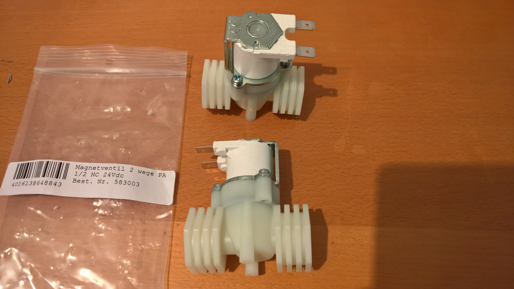
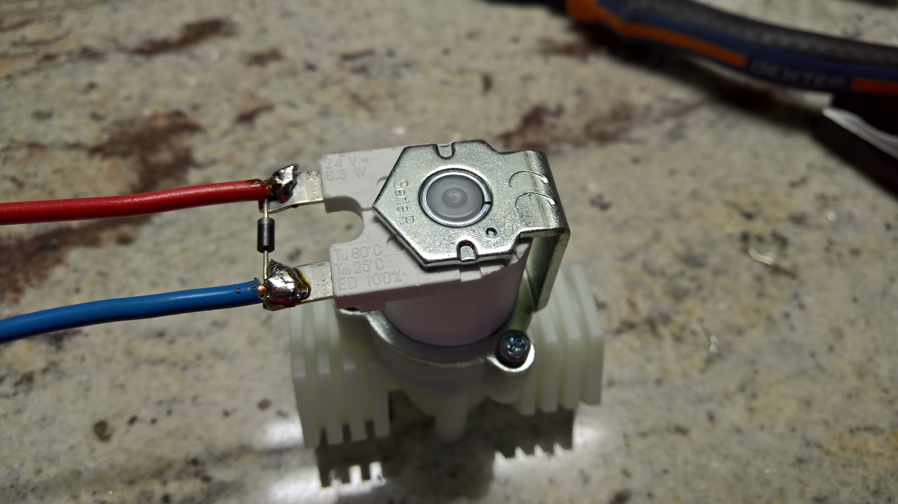
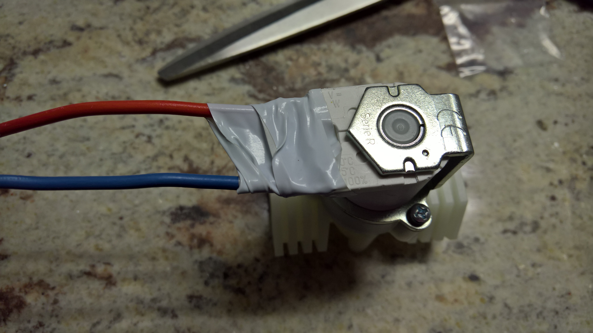
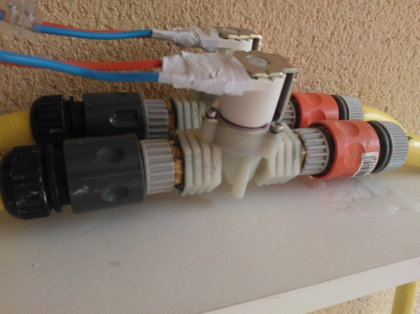
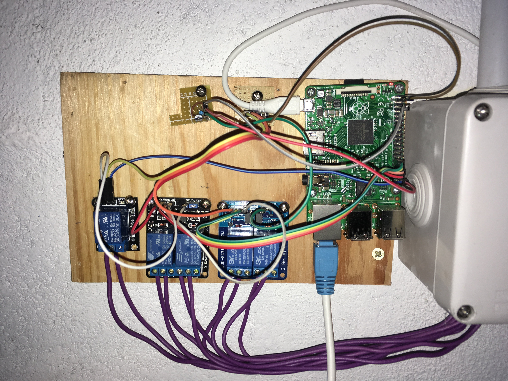
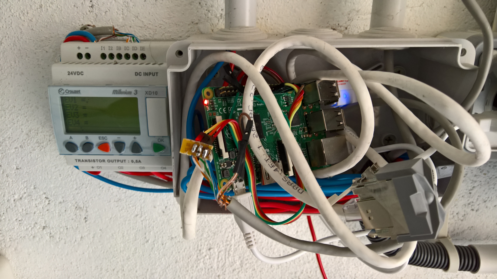

# Azure IoT Edge ASP.NET Core and .NET Core IoT Sprinkler system
Manage a real Sprinkler system with a RaspberryPi or any other device, all connected to Azure IoT Hub, deployed ans managed thru Azure IoT edge, running using ASP.NET Core and .NET Core IoT. Settings stored in an Azure Blob Storage. authentication centralized in an Azure SQL Database.

The code have been tested and adjusted to work as well natively without having any or part of the services. So you can use it as a packaged .NET Core app copy/paste into a directory and then lunched as a service. Or you can use all or part of the services. 

*note*: for the best experience, it is of course recommended to use all the Azure services.

## Hardware
You need the following hardware:
- 24V transformer with at least at least 2A output (or more or less depending on your electro valves)
- 24V electro valves
- 1 diode per electro valve
- 3.3V Relay

Alternatively if you're on a balcony, you can use a simple 5V pump and couple of 5l bottles for the water. 

### 24V transformer
You can find easily find the 24V transformer on online shops easily.

### 24V Electro valves
Here are pictures of the electro valves I have at home. They are quite easy to find online.

The diode is used to make sure when the current is stop, the residual current can escape. Just iron it on the electro valves. Some electro valves may already have some.
Add cables as well on your electro valves so you'll be able to cable them on the relay.

Finally, isolate the electro valve’s electric plugs. Electro valves are supposed to be ok to work on wet environment, that said, I recommend to have them in a place where you’ll limit the water.

In my case, I’ve placed them on a spot protected from the rain.


### 3.3V Relay
You can use as many relay as you need. Output pins from Raspberry are:

```csharp
private const int GPIO_PIN_D0 = 5;
private const int GPIO_PIN_D1 = 6;
private const int GPIO_PIN_D2 = 13;
private const int GPIO_PIN_D3 = 19;
private const int GPIO_PIN_D4 = 26;
```

So you’ll need to connect the output of each pin to the relay pin entry. Don’t forget as well the 3.3V and the ground.


Here is how it can look like with 5 relay. Note that the code now implement a pin select for the realy alimentation. Pin is GPIO20. The setup files include as well a variable inv0, inv1, etc to be set at 1 if you want an inverted output. If not, then you can ignore. I did this because the group of 2 relay has inverted input. A high level will open the relay, a low one close it. To avoid consume too much energy, I have implemented the capacity to have inversted output and alimenting the relays. In case the rapsberry reboot and the program will not lunch, the relay won't be alimented. So there is no risk of opening them, so no risk of sprinkling indefinitely.


To replace the relay, you can use as well an programmable automate like I did in the past. I no longuer use this setup as the automate stopped working after multiple years.


*note*: as a security, there is the possibility to use an enabler for the relays. This is particularly usefull to make sure that during the initializing phase you won't sprinkler accidently.
```csharp
private const int PinRelayOn = 20;
```

Use this technic with a simple transistor in the chain between the relay and the ground. Once the service is setup, the pin is automatically setup to high which will close the transistor and will make the relay usable. It is even more recommended for inverted relays which will close when the input is low. During boot process, on RPI, pins are put to low. 

## Building the ASP.NET Core app

You have a ```buildandpush.bat``` command line to build an push your container. Replace the container name into the file for your own one. Don't forget to log into your Azure Registry before building and pushing the container.

*note*: 
- if you just want to create the container without pushing it, edit the bat file to remove the second line. Make sure you'll adjust the name of your container.
- if you just want to deploy the app as a normal app, just use ```dotnet build -r linux-arm -c Release```. It will create a deployment folder that you'll be able to use on your device.

## Authentication

authentication can be done either centrally using an Azure SQL Server database either thru a local file. The Azure SQL Database is great as soon as you have multiple sprinklers you manage. Don't forget to open the firewall of your database to allow access from the RaspberyPi device.

You can use as well the local storage. Be aware that in that case, when you'll redeploy the container, you will loose the data. 

Make sure you'll fill the connection string into the ```apppsettings.json``` file before building the container.

Connection string will look like that:

```json
"ConnectionStrings": {
    "ConnectionToUse": "SQL",
    "DefaultConnection": "Server=tcp:servername.database.windows.net,1433;Initial Catalog=catalogname;Persist Security Info=False;User ID=useridt;Password=password;MultipleActiveResultSets=False;Encrypt=True;TrustServerCertificate=False;Connection Timeout=30;",
    "LocalConnection": "DataSource=Files/app.db"
  },
```

*notes*:
- if you are not using Azure IoT Edge for deployment and just deploying your solution locally by packaging an app, if you want to use the Azure SQL Database, make sure you create an environment variable ```DB_CONNECTION``` with value ```SQL```. all other values will lead to using the local storage.
- if you are not using Azure IoT Edge for deployment but still making a container, same as in previous point, you'll need to create the environement variable. Note, you can as well mount a volume to point on the ```Files``` folder. When redeploying a new application, this will avoid errasing your settings data.

**Important**: the first user you will create will automatically become administrator. Just open your sprinkler URL and add /Users. This will initialize it to be administrator. Disconnect and reconnect.

## Settings file and history

By default settings file and history are uploaded into an Azure Blob Storage but they are saved as well locally. In case your system will be offline, the offline mode will use those local files. They are stored into the ```Files```folder.

Don't forget to add your connection string in the ```appsettings.json``` file, it will look like that:

```json
"AzureBlobSetings": {
    "AccountName": "youraccountname",
    "AccountKey": "yoursupersecuritykey",
    "ContainerName": "yourcontainername"
  }
  ```

Everyfile will be stored with the name of the device. Name of device is extracted from the Azure IoT Hub connection string: ```IOTHUB_DEVICE_CONN_STRING```. An Azure IoT Hub connection string looks like that: ```HostName=youriotedge.azure-devices.net;DeviceId=yourdevidename;SharedAccessKey=supermegasecretkey```
in case you are not using Azure IoT Hub but want to use the blob storage, make sure you are at least setting the device name like this ```DeviceId=yourdeviceid``` where yourdeviceid is the name of the device.

*notes*:
- if our are making modification into those files and you are not connected, if there is a reboot in the mean time and you'll get connected at this reboot (or relaunch of the container), the blob storage data will be used. A sync between the offline data and the blob storage is not implemented yet
- You can only use local storage if you want. Just be aware, like for the authentication database, that if you redepoy the container, you'll loose the local data. To avod that, you can mount a volume. 
- If you are deploying the app just as files and run them outside the container, and using local storage, make sure you'll backup your settings and database files first
- if you want to use the local storage only, set empty string in the connection strings of the blob storage.

## Azure IoT Edge connection

You can connect your sprinkler to Azure IoT Edge to pass messages and get information regartding the status of the sprinkler. You need to pass the environement variable ```IOTHUB_DEVICE_CONN_STRING``` which should contain the Azure IoT Edge connection string. An Azure IoT Hub connection string looks like that: ```HostName=youriotedge.azure-devices.net;DeviceId=yourdevidename;SharedAccessKey=supermegasecretkey```. This connection string is different from the Azure IoT Edge connection string. Think of it as a child device of your Azure IoT Edge. Think as well that you may have other edge elements running.

*note*:
- if you are using Azure Iot Edge for deployement, you'll pass this environement variable like the other one in the deployment template.
- If you are using the container or the local deployement, make you you'll create it in your system.

The connection to Azure IoT Edge will allow you to send commands to your sprinkler.

The class used to pass the command is the following:

```csharp
public class MessageIoT
{
public string command { get; set; }
public string message { get; set; }
}
```

It is a json serialized object which then look like: ```{"command":"sprinklername"}```. Note that the message element is a json object as well. Once you'll deserialize the main json object, the message will be deserialized as well. So make sure you'll serialize your message, add it to your MessageIoT and then serialize it again.

Commands are the following:
- sprinklername: will send back the name of all the sprinklers with detailed information
- programs: will send back all the programs
- addprogram/removeprogram: will add or remove a program. Sytax is the following: ```{"command":"addprogram","message":"{\"DateTimeStart\":\"2016-06-02T03:04:05+00:00\",\"Duration\":\"00:02:05\",\"Number\":3}"}```
- pumpstart/pumpstop: will open or close a sprinkler. The message is then the sprinkler number.

## Azure IoT Edge Setup

You have to have one Azure IoT Edge device setup per Sprinkler you want to manage. It's very straight foreward, create your IoT Edge device. Add a module with the needed information.

Then you should create a new module:


And make sure you add your Docker registry information:


Then add an IoT Edge module:


Fill the various information for the module:


The create container options are the following:

```json
{
  "ExposedPorts": {
    "80/tcp": {}
  },
  "HostConfig": {
    "Privileged": true,
    "PortBindings": {
      "80/tcp": [
        {
          "HostPort": "80"
        }
      ]
    }
  }
}
```

For the environement data, use both the ```IOTHUB_DEVICE_CONN_STRING``` and the ```DB_CONNECTION```. See previous sections for more information. 

In case you want to use a deployment template rather than the interface, you can use the follwing. Don't forget to replace the *your* elements by your own registry information, secrets, etc.

```json
{
    "modulesContent": {
        "$edgeAgent": {
            "properties.desired": {
                "modules": {
                    "sprinkler": {
                        "settings": {
                            "image": "yourregistry.azurecr.io/yourmodulename",
                            "createOptions": "{\"ExposedPorts\":{\"80/tcp\":{}},\"HostConfig\":{\"Privileged\":true,\"PortBindings\":{\"80/tcp\":[{\"HostPort\":\"80\"}]}}}"
                        },
                        "type": "docker",
                        "version": "1.0",
                        "env": {
                            "ASPNETCORE_ENVIRONMENT": {
                                "value": "Development"
                            },
                            "IOTHUB_DEVICE_CONN_STRING": {
                                "value": "HostName=youriot.azure-devices.net;DeviceId=yourdevice;SharedAccessKey=yoursecretkey"
                            },
                            "DB_CONNECTION": {
                                "value": "SQL"
                            }
                        },
                        "status": "running",
                        "restartPolicy": "always"
                    }
                },
                "runtime": {
                    "settings": {
                        "minDockerVersion": "v1.25",
                        "registryCredentials": {
                            "ellerbach": {
                                "address": "yourregistryname.azurecr.io",
                                "password": "yourpassword",
                                "username": "yourusername"
                            }
                        }
                    },
                    "type": "docker"
                },
                "schemaVersion": "1.0",
                "systemModules": {
                    "edgeAgent": {
                        "settings": {
                            "image": "mcr.microsoft.com/azureiotedge-agent:1.0",
                            "createOptions": ""
                        },
                        "type": "docker"
                    },
                    "edgeHub": {
                        "settings": {
                            "image": "mcr.microsoft.com/azureiotedge-hub:1.0",
                            "createOptions": "{\"HostConfig\":{\"PortBindings\":{\"8883/tcp\":[{\"HostPort\":\"8883\"}],\"443/tcp\":[{\"HostPort\":\"443\"}],\"5671/tcp\":[{\"HostPort\":\"5671\"}]}}}"
                        },
                        "type": "docker",
                        "env": {
                            "OptimizeForPerformance": {
                                "value": "false"
                            }
                        },
                        "status": "running",
                        "restartPolicy": "always"
                    }
                }
            }
        },
        "$edgeHub": {
            "properties.desired": {
                "routes": {
                    "route": "FROM /messages/* INTO $upstream"
                },
                "schemaVersion": "1.0",
                "storeAndForwardConfiguration": {
                    "timeToLiveSecs": 7200
                }
            }
        },
        "sprinkler": {
            "properties.desired": {}
        }
    }
}
```
